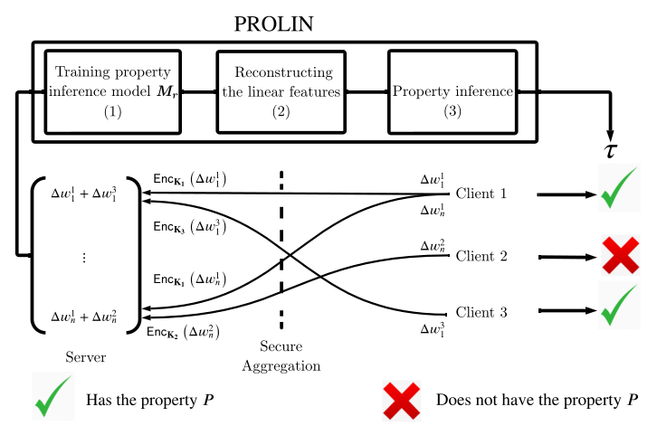

# PROLIN
[](LICENSE)
[](https://www.python.org/)
[](https://pytorch.org/)




This repository contains the implementation for ["Client-specific Property Inference against Secure Aggregation in Federated Learning (WPES 2023 Workshop, in conjunction with CCS'23)"](https://arxiv.org/abs/2303.03908).

Contact: Raouf Kerkouche ([raouf.kerkouche@cispa.de](mailto:raouf.kerkouche@cispa.de))

## Requirements
 - This implementation is based on [PyTorch](https://pytorch.org/) (tested for version 1.7.1).
 - Create the following folders: ```'Presentation'```,```'Presentation_aga'```,```'Presentation_inv'``` and ```'Results_CCS'``` inside ```./experiments```
## Running Experiments
```Please enter the folder.
cd experiments 
```
### Step 1: Simulating Federated Learning
```main
python federated_main-mnist-mia-attack.py \
```
- Use the format ```federated_main-{dataset}-{attack type}-attack.py```.
- Attack type: ```'mia'```,```'inv'```, ```'aga'``` has been tested.
- Dataset: ```'MNIST'```,```'Fashion-MNIST'```, ```'CIFAR10'``` has been tested.
- option.py, optionsfashionmnist.py, and optionscifar.py are used to set parameters according to the datasets used, i.e. MNIST, Fashion-MNIST, and CIFAR-10, respectively.

### Step 2: Running 'PROLIN'
```main prolin
python prolin.py
```
### Step 3: Generating the figures
- Please use the Jupyter Notebook ```'Plot_figures.ipynb'``` to generate the figures.

## Citation
```bibtex
@article{kerkouche2023client,
  title={Client-specific Property Inference against Secure Aggregation in Federated Learning},
  author={Kerkouche, Raouf and {\'A}cs, Gergely and Fritz, Mario},
  journal={arXiv preprint arXiv:2303.03908},
  year={2023}
}
```
## Acknowledgements
Our implementation uses the source code from the following repositories:
- [MTAdam](https://github.com/ItzikMalkiel/MTAdam)
- [Gradient disaggregation](https://github.com/gdisag/gradient_disaggregation)
